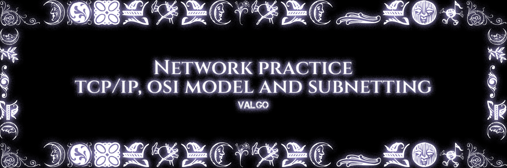
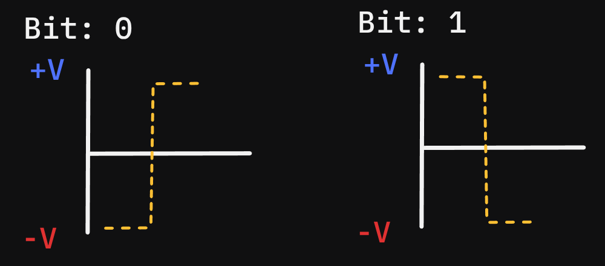
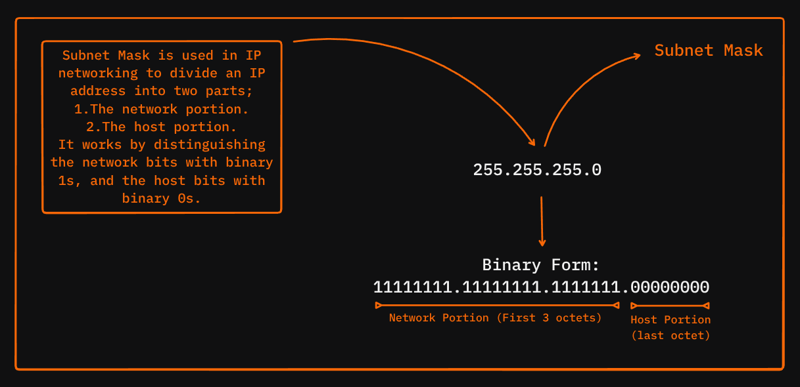
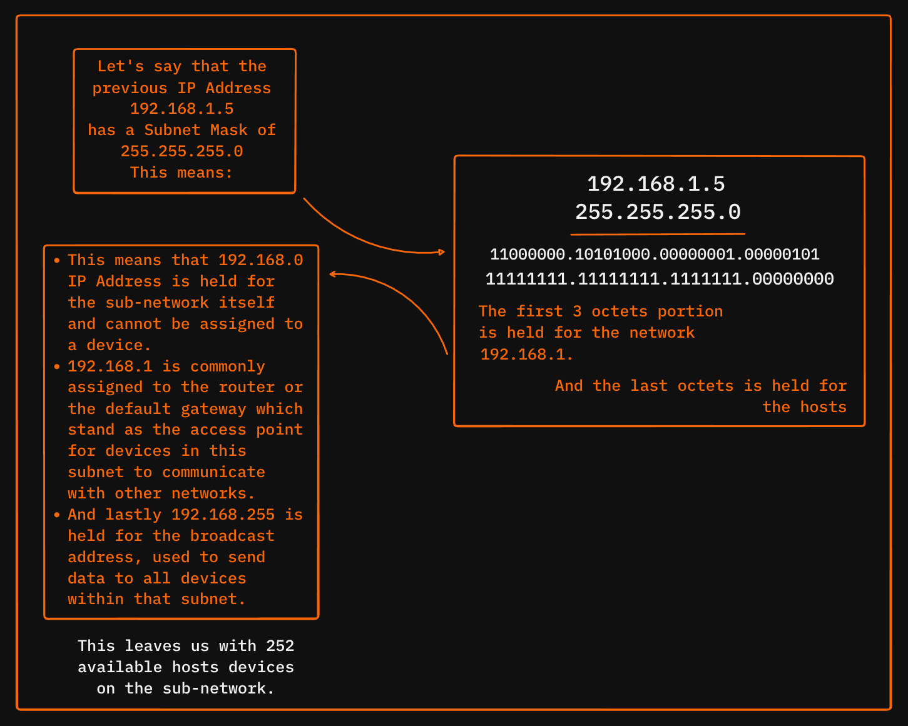

# NetworkPractice

***
***Note: The information provieded might have wrong or unprecise information, its always on you to keep diving into the concepts, and find the real correct and precise knowledege.***
***

***

***This project has been created as part of the 42 curriculum by ayel-bou***
***

### Project Goals
***This projects aims to intreduce the concept of subnetting, its benefits and how can we use it to manage multiple networks efficently and without ip addresses exhaution, alongside with concepts such as: TCP/IP addressing, subnet mask, default gateway, routers and switches, OSI layers, etc.***

### How to interact
The project is practical learning module, providing us with a local website, that you can use after downloading the attached file presented in the project dashboard.
Then you can start in Normal Mode, by entering your 42 login, and each level you pass, you will save on you 42 git repository (make sure you logged in with you exact login as the moulinette will use to know you configuration as the subject says).

### AI usage in this project
AI was used in this project as a tool to gather informations and resources, also understand and go in depth on the presented concept in this readme. **ASK -> READ -> UNDERSTAND -> ASK MORE -> WRITE.**

### Submission details
You have to save & push the Json file you get from each passed level and be placed at the repository root.

* ***Very thankful to this Youtube Channels [LearnCantrill](https://www.youtube.com/watch?v=6hPMdpk9qA4&list=PLTk5ZYSbd9Mi_ya5tVFD8NFfU1YZOyml1&index=1) And [NetworkChunk](https://www.youtube.com/watch?v=5WfiTHiU4x8&list=PLIhvC56v63IKrRHh3gvZZBAGvsvOhwrRF)***

#### What is Subnetting ?

According to a well known resource, **Cloudflare**, a subnet, or subnetwork, is a **Network** inside a network, subnets make networks more efficient.
Through subnetting, network traffic can travel a shorter distance without passing through unnecessary routers to rach its distination.

#### How does devices communicates? What is the OSI Model?

**OSI Model** or Open systems interconnection model, is a conceptual framework used to understand and design how different computer systems communicate over a network.
By deviding the network communication into seven distinct layers, each specific layer has its own functionality, enabling various hardware and software componenets to interoperate and exchange data effectively.

***
### **OSI Model Layers**
***
#### **➤ Physical Layer**: (Layer One)
the main role of this layer, is to transmit raw bits **[0|1]**, from one device to another over a physical medium such as wires, fiber optics or wireless channels, this layer is responsible for converting the digital data into signals suitable for transmission (encoding/modulation) and converting recieved signals back into data (decoding/demodulation).

**What is encoding/modulation ?**

Encoding and modulation are two fundamental processes at the physical layer of the **OSI Model**, that prepare digital data for transmission over physical media;

##### **Encoding:**
encoding is the process of converting raw digital bits [0|1], into a specific pattern of signals that can be transmitted across a physical medium, the encoded signals represent the bits in a way suitable for the transmission environment, ensuring proper synchronization between sender and reciever...{to complete !}
Various encoding schemes exist, such as:

* ***Non-Return-to-Zero (NRZ)***: Uses two voltage levels representing 0 and 1 without returning to zero between bits, meaning if we have [110],
the singal voltage stays high throughout all two bits without dropping to zero in between, and then stays low for the next last bit.
In this type of scheme there is no neutral zero return for the voltage as its stay at the voltage represented by the passing bits.
There different types of the NRZ but the primary two types of NRZ are [NRZ-I/NRZ-L], for further more understanding, here is a Youtube video explaining NRZ-I and how it works: [NRZ-I](https://www.youtube.com/watch?v=Kxndom8GaUQ)

* ***Manchester Encoding***: The direction of a transition between positive and negative voltage in the middle of the bit time represents the data.
In this type of encoding, there is two type conventions for representing binary data, **BIPHASE-L (Mancherser II)** and **IEEE 802.3 / IEE 802.4**.

This is the first convention **BIPHASE-L**:
***

***

the **IEEE 802.3 / IEE 802.4** is the opposite of the above convention.
for further more understanding, here is a Youtube video explaining **BIPHASE-L (Mancherser II)** and how it works: [Mancherser II](https://www.youtube.com/watch?v=J00Hfx-tF-U)

**Note**:
The reciever of the coming data, has hardware decives called **Network Interface Cards** **(NICs)** that are designed and programmed to catch, interpret, decode and demodulate the physical signals into digital bits based on the encoding scheme used (NRZ, Manchester...).
this **(NICs)** is controlled by firmware (low-level software) and drivers within the operating system, which manage the communication between hardware and higher-level network protocols.

##### **Modulation:**
Modulation prepares the signal for effective transmission by imprinting the encoded data onto a fast-moving carrier wave tuned to a frequency that travels well through the chosen medium, ensuring reliable reception at the other end.
The coming encoded data arrives, the modulator changes the carrier's amplitude, frequency or phase according to the encoded signal, effectively embedding the data onto this wave.
So modulation tailors the encoded digital data to physically compatible signals that can be transmitted reliably over the intended medium, this process ensures the data can travel long distances or through complexe environments while being received and decoded properly at the other end.

**How does modulation helps the data to travel safely?**:
An example of modulation functionality, is shifting the encoded data onto a high-frequency carrier wave, so it allow it to propagate further without significant loss or distortion compared to low-frequency baseband signals, higher frequency carriers suffer less attenuation, making long-distance communication possible.

***
#### **➤ Data Link Layer**: (Layer Two)
On this layer, the raw bits and signals prepared by the **Physical Layer** through Encoding/Modulation process, gets organized through frames, and this layer is responsible for error detection and sometimes correction.

**Data Link Layer functionality**:
The base functionality of this layer, is the **Framing**, through a process of **Encapsulation**, the data packets are encapsulated into a frame by adding a header and trailer around the packet data.

***Frame parts for different functionalities***:

* 1: **The Preamble**: its a special pattern of bits sent at the very beginning of each frame, its main functionality is; Synchronization, it allows the receiver's hardware to synchronize its clock with the incoming signal from the sender; it also signals the receiver that a new frame is about to start, preparing the receiver circuits to process the incoming data.
in Ethernet, for example, the preamble consists of 7 bytes (56 bits) followed by a 1-byte Start Frame Delimiter **(SFD)** indicating the start of the frame's content.

* 2/3: **Destination/Source MAC Addresses**: a 6-bytes (48 bits) field containing the unique physical address of the device (Destination for the device we are sending to/Source for the device thats sending the data). 

* 4: **EtherType**: this field is an Ethernet frame (16 bits) that tells the recieving devie what kind of data is inside the frame's payload so it knows how to handle it, when a frame is sent the data part usually contains an IP packet, this packet can be either IPv4 or IPv6, the EtherType field contains a specific value that identifies them, the reciever looks for this to figure out what network layer protocl is carried inside so it passes the data payload to the appropriate protocol handler based on the IP version of the packet.

* 5: **Payload**: Here lies the IP packet itself, alongside its encapsulated hight-layer data (like TCP/UDP segments). its size is variable but must meet certain size requirements, Ethernet insists on a minimum payoad size of 46 bytes to ensure proper transmission, so if the actual data is smaller, the payload is padded with extra bytes, the maximum payload size is typically 1500 bytes (called the Maximum Transmission Unit) on standard Ethernet, but some networks support larger frames.

* 6: **Frame Check Sequence (FCS)**: (4-bytes/32 bits) field containing the **Cyclic Redundancy Check** value, this value is a checksum calculated from all previous parts of the frame and is used by the receiver to detect errors introduced during transmission.
***

#### **➤ Network Layer**: (Layer Three)

This layer is responsible for moving data packets from the source host to the destination host across one or more networks, its main functionalities include:

* **Logical Addressing**: Assigns IP addresses to devices, ensuring proper identification and communication across networks.
* **Packetization**: Encapsulates data from Transport Layer into packets for transmission.
* **Routing**: Determines the best path for packets to travel across multiple interconnected networks using routing protocols and algorithms.
* **Forwarding**: reading a packet's desitination IP, looking up the best route in the forwarding table, and sending the packet out the right interface toward its destination.
* **Fragmentation and Reassembly**: Splits packets into smaller fragments if they exceed the network's Maximum Transmission Unit (MTU), then reassembles them at the destination.
* **Subnetting**: Divides larger networks into smaller subnetworks for effecient addressing and traffic management.
* **Netwrok Address Translation (NAT)**: Maps private IPs to public IPs for internet communication, conserving address space and adding security.

***Protocols Operating at the Network Layer***

* IP (Internet Protocol): The fundamental protocol for addressing and routing packets between devices on networks, using data encapsulation from the Transport layer into packets with IP headers containing source and destination IP addresses (IPv4/IPv6), then routed across muiltiples networks from the source to the last end.
* ICMP (Internet Control Message Protocol): a supporting protocol used mainly by routers and hosts to send error messages and operational information.
* ARP (Address Resolution Protocol): a protocol used in IPv4 networks that maps an IP address to the physical MAC address of a device on a local network.
* NAT (Network Address Translation): A technique used to translate private (local) IP addresses to a signle or a few public IP addresses, so once a packets is forwarded from a device its forwarded to the internet as an public IP that defines that local network.

***
#### **➤ Transport/Session Layer**: (Layer Four/Five)

* **Transport Layer**: Handles end-to-end communication between hosts, focusing on reliable data transfer, flow control, error correction, segmentation and managing connections (TCP sessions), it ensures data arrives complete and in order.
* **Session Layer**: manages sessions or dialogues between applications, focusing on establishing, maintaining, synchronizing and terminating communication sessions, it can also insert checkpoints and handle recovery from interruptions within long sessions.

#### **Transmission Control Protocol (TCP)**:

The Transport Layer and the Session Layer intersect in practical terms when a TCP connection is established:
➤ TCP is a connection-oriented protocol used to transmit data over a network, ensuring reliable, ordered error checking in delivery between devices:

* The conncetion establishment works using the **Three Way Handshake [SYN, SYN-ACK, ACK]**.
* THe Data transmission works by breaking the large data into segments, each one has a sequence number that can be used to re assable the segmented data as a whole again, each time the reviever gets a data he send **ACK** sign of aknowledgment to the sender as the data being recieved, if the **ACK** was not sent, the sender re send the data.
* Controling the flow of data transmission, by windowing how much data must be sent in order to not overwhelm the reciver.
* Error handling by detecting corrupted data; corrupted segments are retransmitted.
* The connection terminates by sending **FIN** & **ACK** signs to end the connection.

➤ TCP which operates at the Transport Layer, manages end-to-end connection oriented communication, providing reliabel data transfer, packet sequencing and error correction, when a TCP connection is established, it implicitly establishes a session-an ongoing maintained communication link between two endpoints, this session management resembles the tasks attributed to the Session Layer, such as connection establishment, maintenance, synchronization and termination.

**Note**: The Session Layer, still has it own functionalities seperated from what TCP performs, although some of the Session Layer roles are embeded in the TCP, yet this layer manages higher-level session controls, such a dialog control, synchronization points or checkpoints (for recovery), token management (to avoid conflicts in dialogs), and more complexe coordination between multiple interactions or multiple conncetions that TCP alone does not handle.

***
#### **➤ Presentation Layer**: (Layer Six)

The Presentation Layer focused primarily on data translation encryption, compression and formatting so that data from the sender's application is properly prepared for the reciver's application, this layer acts as translator and protector of data for the **Application Layer**.

➤ Functionalities:

* **Data Translation**: Converts data between different formats or endocing schemes used by different systems (translating characher encoding like ASCII to EBCDIC), so different platforms can understand each other.
* **Data Compression**: Reduces the size of teh data to decrease transmission time and resource usage.
* **Data Encryption/Decryption**: Secure data by encrypting it before transmissin and decrypting it on the receipt to protect against unauthorized access.
* **Syntax and Semantics Management**: Ensures that complext data structures, like graphics or multimedia files, are formatted and represented consistently across platforms.
***

#### **➤ Application Layer**: (Layer Seven)

This layer, is the top layer of the **OSI Model**, it serves as the closest layer to the end user, it provides the interface between user applications and teh underlying network, enabling software programs to communicate over network.

➤ Functionalities:

* **Network Virtual Terminal**: Allows users to log onto remote systems as if they were local, facilating remote access.
* **File Transfer, Access and Managaement (FTAM)**: Provides services for accessing, retreiving and managing files on remote hosts.
* **Email Services**: Manages sending, receiving and storage of email messages via protocols such as **SMTP, POP3 and IMAP**.
* **Directory services**: Offers distrubuted databases for finding information about network resources such as username, services or devices.
* **Name Resolution**: Converts human-friendly domain names to IP Adresses using DNS.
* **Remote Login**: Enables users to securely log into another computer or server (through SSH).
* **Data Representation and formatting**: Ensures data is presented in user-freindly formats, oftern interacting with the Presentation Layer for encoding, encryption and compression.
* **User Authentication and Authorization**: Verifies user identities and controls access right to network resources.
* **Error Handling and Recovery**: Provides mechanisms to detect errors and recover from communication failures within applications.

***Common Protocols at the Application Layer:***

* HTTP/HTTPS (Web Browsing)
* FTP (File Transfer Protocol)
* SMTP (Simple Mail Transfer Protocol) for sending, POP3 or IMAP for receiving
* DNS (Domain Name System)
* DHCP (Dynamic Host Configuration Protocol)
* Telnet, SSH (Remote Login)
***

***
### **Subnetting**
***

Before going into subnetting, we need to know and understand one of the key concepts:

* **Default Gateway**:
Is the device that sends your traffic out of your local network, when the wanted destination is out of reach and no on the same network, the default gateway is usually the router connceting multiple networks together.

* **Routers**:
Router is a device that conncets multiple networks together, deciding the best path for the data to travel across networks, and in the project standards we have:
* Routing Table: is a table holding information for the router to know the next hop the data should be sent to, and the destination.
* Destination: the device we would like the packet to reach as an end destination that we configure inside the routing table of the router.
* Next Hop: which is the next router or interface is going to be used as a route in order to reach the destination device.

* **Switches**:
Switch is a device that connects multiple devices within the same network, and forward the data to the specific device configured as destination, they operate solely inside a local specific network, not like **Routers**, **Switches** rely on MAC addresses rather than IP.

Subnetting is the proceess of divigin a large IP network into smaller, more manageable pieces called subnets or subnetworks, each subnets functions like a smaller network within the bigger network.
It solved and provided multiple enhancements, such as:

* **Efficeint IP Address Management:** it helps organizations use thier IP addresses more wisely by dividing a large network into smaller parts tailored to their needs, instead of giving out too many IP addresses that aren't needed, subnetting creates networks of just the right size for each group of devices
* **Improved Network Performance**: By breaking a big network into smaller subnets, local traffic stays withing the usbnet, reducing congestion and collision on the network.
* **Better Security and Control**: Subnets isolate group of devices, so network administrators can apply different secufiry policies and control traffic between subnets.
* **Simplifide Network Management**: Smaller subnetworks are easier to manager and troubleshoot compared to a single large network.
* **Supports Routing Efficiency**: Routers only need to manage traffic between subnets rather than every individual device, optimizing routing tables and paths.

Before subnetting, large networks were inefficient and uwiedlym causing issues like IP address exhaustion, network congestion and diffuclty in managing resources, subnetting solved these by allowing netwroks to be logically segmented, improving resource utilizaton, performance and scalability.

### **Subnetting Diagrams**
***

***

***

***